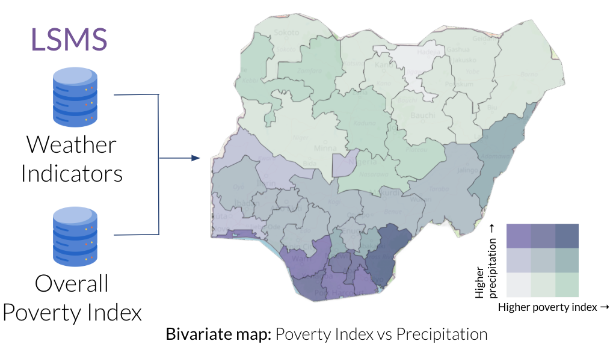

Welcome to **jmpst** documentation!
==========================================

.. todo:: 
   Resolve references to other documents

**jmpst** is a codebase for analysing impact of climate change on child poverty.

Extreme weather events disproportionately impact millions of children living in poverty around the world. The goal of this project is to reduce the entry barrier for research and analysis of extreme weather impacts on child poverty and wellbeing, and to provide an extensible framework for researchers and concerned citizens to analyse the same.  

About this Project
-------------------
In this project, longitudinal and geocoded survey data is linked with weather datasets to analyse the impact of extreme weather events, such as heatwaves, heavy rainfall and droughts, on multidimensional child poverty and wellbeing. 

A data dashboard is also created which allows users to explore and visualise extreme weather and poverty datasets. The dashboard also allows users to upload geographical coordinates and receive weather time series for those locations. 

Data and feature engineering pipelines for LSMS-ISA surveys and extreme weather data are present in the codebase. Some useful visualisations are also present. Functions to use them are listed in the API reference.

A youtube `video <https://youtu.be/qhoYJ5NAQm0?si=u2GguFr14zq28hnw>`_ outlining the purpose and goals of the project is available. The Project poster is available :download:`here <_static/poster.pdf>`. 

Check out the :doc:`getting-started` section for further information about how to begin, including installation of the package.

Raw data required for the data pipeline needs to be downloaded and stored in specified formats. The data is further explained in :doc:`data`. Methodology used by the project is explained in :doc:`methodology`.

Information for contributors is available in :doc:`extensibility`.

The API reference for all the functions in the codebase is available in the :ref:`genindex` section.

People
-----------------
The package was developed during DSSGxGermany 2023, in partnership with Save the Children, University of Oxford, and  UNICEF. We thank the Rheinland-Pfälzische Technische Universität Kaiserslautern-Landau (RPTU) and Deutsches Forschungszentrum für Künstliche Intelligenz (DFKI) for funding the project. We also thank DFKI and University of Kaiserslautern for hosting the project. 

We thank the project staff for their guidance and support:

- Julia Ostheimer - Project Technical Mentor
 
- Gernot Schreider - Project Manager
 
- Stefanie Osewalt - Program Assistant
 
- Andrea Sipka - Program Manager
 
- Sebastian Vollmer - Program Director

Fellows working on the project:

- Jama Hussein Mohamud
 
- Prahitha Moova
 
- `Shikhar Mishra <https://github.com/smishr>`_

- Trey Roark

- Moshood Yekini

.. toctree::
   :caption: Table of Contents
   :name: toc_home
   :maxdepth: 3

   Home <self>
   getting-started
   data
   methodology
   extensibility
   bibliography
   resources
   
API Reference
-----------------

* :ref:`genindex`
* :ref:`modindex`
* :ref:`search`

.. _LSMS-ISA: https://microdata.worldbank.org/index.php/catalog/lsms
.. _DHS: https://dhsprogram.com/Data/
.. _MICS: https://mics.unicef.org/surveys